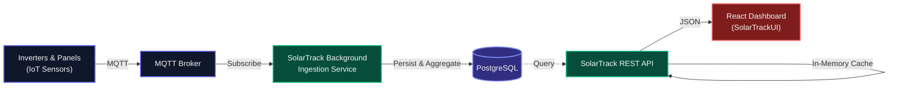

  <h1>☀️ SolarTrack Core API</h1>
  
<b>Production-ready IoT Telemetry & Monitoring Backend</b>

  
A scalable, high-throughput backend system for collecting, processing, and aggregating real-time telemetry from solar panels and battery inverters.

  <a href="https://solartrack.runasp.net/"><b>Explore the Live Demo</b></a> •
  <a href="https://github.com/sdwck/SolarTrackUI"><b>Frontend Repository</b></a>

  
  
  
  

---

## 📖 Overview

SolarTrack is built to solve the challenge of ingesting continuous hardware sensor data without dropping packets or overloading the database. It provides a robust API for the frontend dashboards and a background ingestion pipeline for hardware communication.

### 🏗 Architecture

The project strictly follows **Clean Architecture** principles to separate domain logic from infrastructure concerns:

*   **`SolarPanel.API`** — Presentation layer exposing REST endpoints for the web client.
*   **`SolarPanel.Application`** — Business logic, Use Cases, and CQRS handlers.
*   **`SolarPanel.Core`** — Enterprise domain entities, Value Objects, and repository interfaces.
*   **`SolarPanel.Infrastructure`** — Data persistence (EF Core), MQTT Broker integration, and external services.

## ⚡ Key Features

*   **High-Throughput MQTT Pipeline:** Asynchronously consumes hardware telemetry without blocking the main HTTP threads.
*   **In-Memory Caching Strategy:** Aggregated metrics (daily production, efficiency) are cached in-memory to ensure millisecond-level response times for the frontend dashboard.
*   **Historical Data Aggregation:** Automatically groups raw time-series data into readable formats (hourly, daily, monthly) for chart rendering.
*   **Maintenance & Alerts Logic:** Backend evaluation of threshold breaches (e.g., over-voltage, temperature spikes) to trigger system alerts.

## 💻 Related Repositories

This backend powers the **SolarTrack UI**. You can find the React + TypeScript frontend code here:  
👉 **[github.com/sdwck/SolarTrackUI](https://github.com/sdwck/SolarTrackUI)**

---

## 📸 System Previews

<b>Click to expand Dashboard Screenshots</b>

 

| Main Dashboard | Power Flow Visualization |
| :---: | :---: |
|  |  |

| System Health & Diagnostics | Battery Analytics |
| :---: | :---: |
|  |  |

| Analytics & Comparisons | Energy History |
| :---: | :---: |
|  |  |

| Maintenance Management |
| :---: |
|  |

